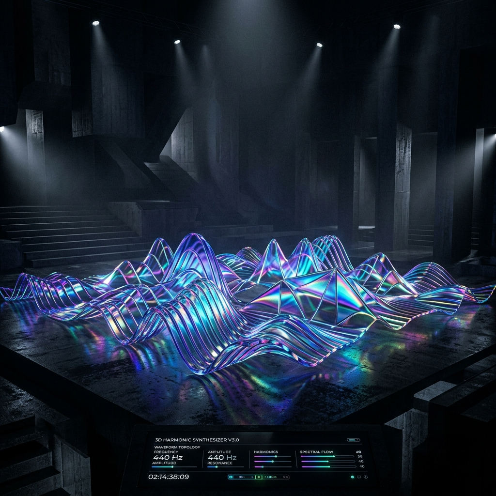

  

  # SYNTHETICA
  ### Equation-Based Digital Audio Workstation

  [Live Demo](https://synthecia-168810048178.us-central1.run.app)

---

Synthetica generates audio from mathematical functions in real-time. It is a Digital Audio Workstation designed for precision synthesis and multi-track arrangement. Sound here is not sampled; it is calculated.

## Features

- **Mathematical Synthesis**: Pure JavaScript functions drive raw audio worklets.
- **Producer Studio**: Multi-track timeline for arrangement and volume automation.
- **Persistence**: Project state saves locally in the browser.
- **Effects**: Integrated master reverb and stereo processing.

## Tech Stack

- **Core**: Next.js 15, React 19.
- **Audio**: Tone.js and the Web Audio API.
- **Cloud**: Dockerized for Google Cloud Run.

## Development

### Prerequisites
- Node.js 20 or higher.
- Google Cloud SDK.

### Commands
1. **Install**: `npm install`
2. **Dev**: `make dev`
3. **Deploy**: `make deploy`

---

  Mathematics is the score.

